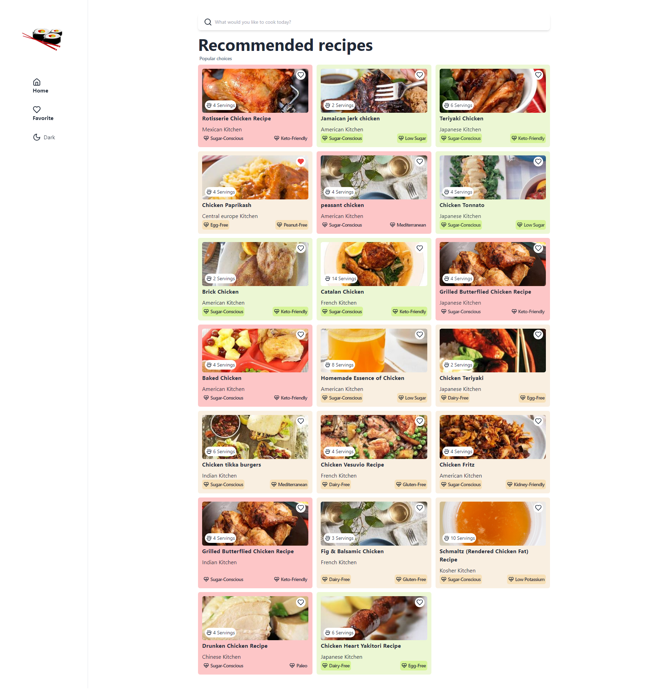
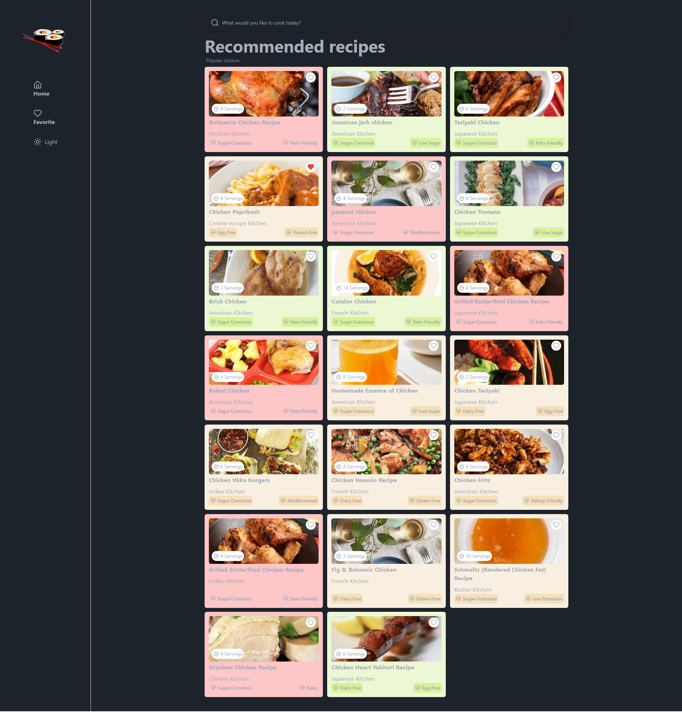
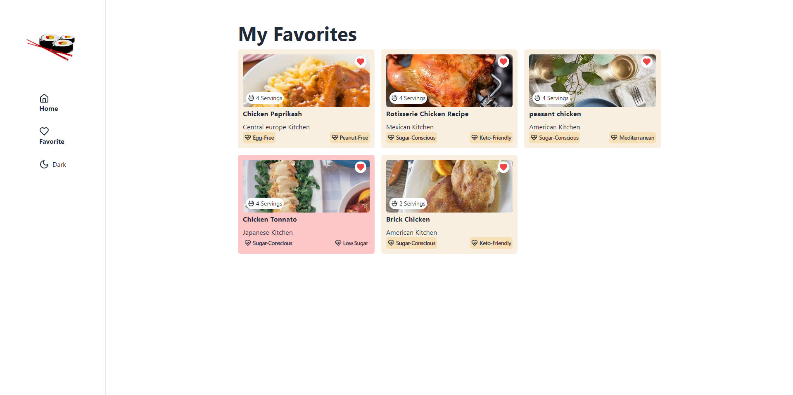
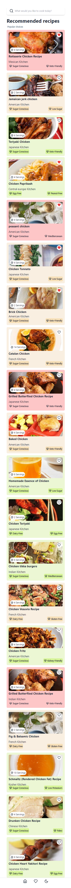

# UniBite-Smart-Recipe-Finder

**UniBite-Smart-Recipe-Finder** is a recipe discovery platform designed for college/uni students, elderly people, and individuals living alone. This application allows users to search for, manage, and favorite recipes with a focus on accessibility and ease of use.

## Components

### HomePage

**Functionality:**
- Displays a search form for users to find recipes based on their queries.
- Fetches and displays a list of recipes with a skeleton loader during data retrieval.
- Uses the Edamam Recipe API to fetch recipes, handling API requests, updating the state, and managing loading states.

**Features:**
- Search functionality to filter recipes by ingredients or names.
- Display of recipe cards with dynamic content.
- Skeleton loaders to improve user experience during data loading.

### FavoritesPage

**Functionality:**
- Displays a list of favorite recipes saved by users.
- Handles cases where no favorite recipes are found, providing a custom "404" page.

**Features:**
- Integration with localStorage to manage and retrieve favorite recipes.
- Responsive design to ensure usability across different screen sizes.

### RecipeCard

**Functionality:**
- Displays detailed information about a recipe including image, title, servings, and health labels.
- Manages the favorite status of recipes, allowing users to add or remove recipes from their favorites.

**Features:**
- Interactive elements such as clickable recipe images linking to YouTube search results.
- Dynamic styling and animations, including a skeleton loader for image loading.

### Additional Features

**Dark and Light Mode Toggle:**
- Implemented in both DeskTopSideBar and MobileSideBar components.
- Allows users to switch between dark and light themes, with the current theme saved in localStorage and applied dynamically.

## Technologies Used

- **React:** For building the user interface components.
- **Tailwind CSS:** For styling and responsive design.
- **DaisyUI:** For UI components and theming.
- **Lucide React:** For icons used throughout the application.
- **Edamam Recipe API:** For fetching recipe data.

## User Experience Enhancements

- **Responsive Design:** Ensures compatibility with various devices and screen sizes.
- **Skeleton Loaders:** Provide a smooth user experience by displaying placeholders while content is loading.
- **Theme Toggle:** Allows users to choose their preferred visual mode, improving accessibility and comfort.

### Mobile Version

---

Feel free to explore and contribute to the project! For any issues or feature requests, please open an issue in the repository.
